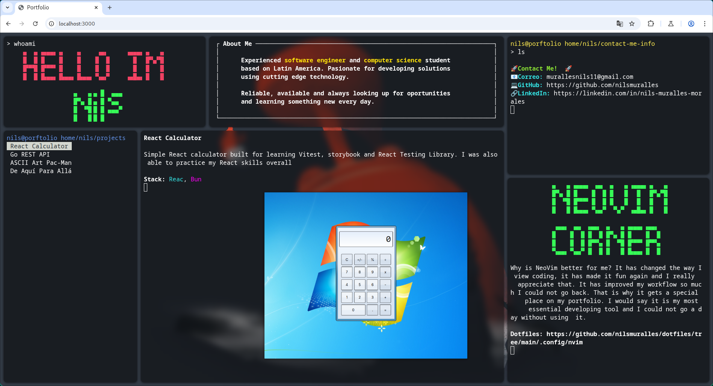
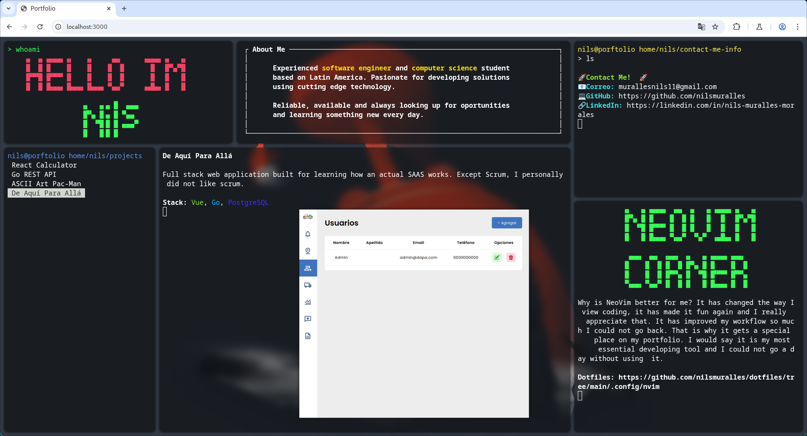

# Portafolio Personal

Este es mi portafolio personal, una aplicación web interactiva que simula un Tiling Window Manager inspirado en Hyprland, donde muestro mis proyectos más destacados, con tecnología y descripciones personalizadas.

## ✨ Características

- 🎨 Interfaz de terminal personalizada con `xterm.js`.
- 🖼️ Vista previa de proyectos con imágenes que aparecen sobre la terminal.
- 💻 Proyectos con descripción, tecnologías y enlaces directos.
- ⚡ Animaciones fluidas y diseño minimalista.

## 🚀 Tecnologías

- **React** (con `react-xtermjs` para la terminal)
- **xterm.js** y sus addons (`fit`, `web-links`)
- **Vite** para la construcción
- **Bun** para manejo de paquetes

## 📸 Screenshots

Aquí puedes ver cómo luce la aplicación:

 

 

## 📦 Instalación

```bash
# Clona el repo
git clone https://github.com/nilsmuralles/P2-Portfolio
cd P2-Portfolio

# Instala dependencias
bun install

# Inicia el servidor de desarrollo
bun run dev
